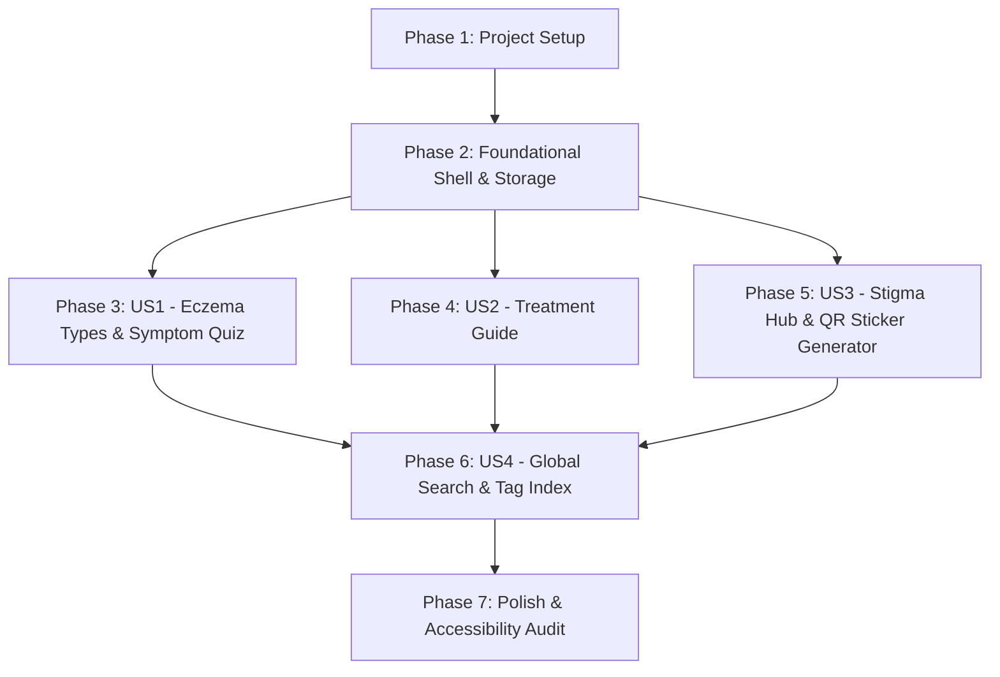

# Tasks: Interactive Eczema Knowledge Wiki & Stigma Reduction Hub

**Feature Identifier**: `1-eczema-wiki`  
**Created Date**: 2026-07-29  
**Status**: Completed 🎉  

---

## Dependency Graph

---

## Parallel Execution Opportunities

- **Phase 1**: T002 (CSS tokens) and T003 (Seed dataset) can run in parallel.
- **Phase 3 & Phase 4 & Phase 5**: Once Phase 2 is complete, US1 (Eczema Types/Quiz), US2 (Treatments), and US3 (Myth Cards/QR Stickers) can be built in parallel.
- **Within US3**: T012 (Myth cards) and T015 (QR sticker canvas exporter) can be developed independently.

---

## Phase 1: Setup

- [X] T001 Initialize project structure and dependencies in `package.json`, `index.html`, and `vite.config.js`
- [X] T002 [P] Setup design system tokens, typography (Google Fonts Inter), and CSS layout variables in `src/styles/index.css`
- [X] T003 [P] Create static seed dataset containing Eczema Types, Treatments, and Myth vs Fact cards in `src/data/eczema-db.js`

---

## Phase 2: Foundational Shell & Storage

- [X] T004 Implement main layout shell and responsive Header Navigation bar in `src/components/Navbar.js`
- [X] T005 [P] Setup local storage state helper utility for vote counts and submissions in `src/utils/storage.js`

---

## Phase 3: User Story 1 - Eczema Types & Symptom Helper Quiz (Priority: P1)

**Story Goal**: Users can browse 6 major eczema types and take a guided 3-step quiz to identify matching types based on symptoms and body parts.  
**Independent Test Criteria**: User can complete the 3-step quiz and see match score percentages sorted by relevance, with modal view details.

- [X] T006 [P] [US1] Create Eczema Types Explorer grid and card components in `src/components/EczemaTypes.js`
- [X] T007 [P] [US1] Create Eczema Type detail modal viewer with medical disclaimers in `src/components/TypeModal.js`
- [X] T008 [US1] Build 3-step interactive Symptom Helper Quiz component in `src/components/SymptomQuiz.js`
- [X] T009 [US1] Implement Symptom quiz match score calculation algorithm in `src/utils/quiz-engine.js`

---

## Phase 4: User Story 2 - Treatment & Management Guide (Priority: P1)

**Story Goal**: Users can explore evidence-based treatment categories (Prescription, OTC Skincare, Trigger Avoidance, Home Routines).  
**Independent Test Criteria**: User can filter treatment categories and view usage guidance, precautions, and mandatory medical disclaimers.

- [X] T010 [P] [US2] Create Treatment & Management guide card list component in `src/components/Treatments.js`
- [X] T011 [US2] Implement category tab filter mechanism (Prescription, OTC, Triggers, Routines) in `src/components/Treatments.js`

---

## Phase 5: User Story 3 - Stigma Reduction Hub, Myth Voting & Printable QR Code Stickers (Priority: P1)

**Story Goal**: Users can flip myth vs fact cards, vote on widespread misconceptions, submit new myths, and export printable QR code stickers for tumblers and laptops.  
**Independent Test Criteria**: User can flip a myth card, increment the "I've heard this myth!" counter, submit a myth, and download a printable PNG QR code sticker badge.

- [X] T012 [P] [US3] Create interactive Myth vs. Fact flip-cards component in `src/components/MythCards.js`
- [X] T013 [US3] Add "I've heard this myth!" validation counter button with local storage persistence in `src/components/MythCards.js`
- [X] T014 [US3] Create "Suggest a Myth" community submission modal form in `src/components/MythSubmissionModal.js`
- [X] T015 [P] [US3] Build HTML5 Canvas Printable QR Code Sticker Generator component in `src/components/QRSticker.js`
- [X] T016 [US3] Implement QR canvas rendering and high-DPI PNG download utility in `src/utils/qr-export.js`

---

## Phase 6: User Story 4 - Global Search & Tag Filtering (Priority: P2)

**Story Goal**: Users can search across types, treatments, and myth cards using a single global search input or multi-tag filters.  
**Independent Test Criteria**: Typing keywords (e.g. "contagious" or "hands") immediately filters matching items across all 3 pillars.

- [X] T017 [P] [US4] Implement full-text search index and tag filter engine in `src/utils/search.js`
- [X] T018 [US4] Connect global search bar input in `src/components/Navbar.js` to instant search results view in `src/components/SearchResults.js`

---

## Phase 7: Polish & Quality Assurance

- [X] T019 [P] Verify accessibility (a11y) ARIA attributes, color contrast, and keyboard navigation across all interactive components
- [X] T020 Verify mobile responsiveness on 9:16 mobile viewport and physical QR sticker scan readability on smartphone camera apps
