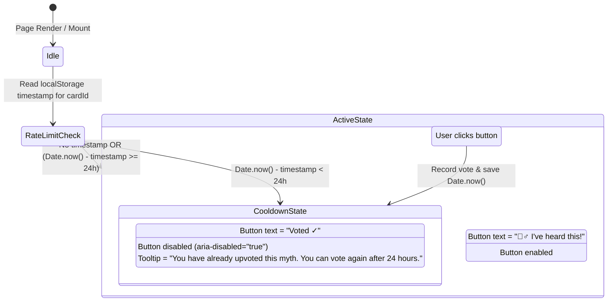

# Data Model & Schema Specification: Myth Upvote Rate Limiting

**Feature Identifier**: `2-limit-myth-upvotes`  
**Created Date**: 2026-07-29  

---

## Client Storage Schema

### 1. Upvote Timestamps Record (`eczemawiki_myth_upvote_timestamps`)

Stored in `localStorage` as a JSON string representing a dictionary of myth card IDs to Unix epoch timestamps (in milliseconds).

```json
{
  "contagion": 1753776000000,
  "hygiene": 1753780000000
}
```

#### Field Specifications

| Field Name | Type | Description | Validation Rules |
| --- | --- | --- | --- |
| `[cardId]` | `string` | Unique key corresponding to a `MythCard` ID (e.g. `"contagion"`, `"hygiene"`) | Must be a valid string ID present in `MYTH_CARDS` dataset. |
| `timestamp` | `number` | Unix epoch time in milliseconds when the upvote was recorded | Positive integer representing valid milliseconds since epoch (`Date.now()`). |

---

## State Transition & Logic



---

## Domain Logic Rules

1. **Cooldown Calculation**:
   $$\text{isCooldownActive} = (\text{currentTimeMs} - \text{lastVotedAt}) < 86,400,000$$
2. **Upvote Validation**:
   - IF $\text{isCooldownActive}$ is `true` $\rightarrow$ REJECT upvote request; do NOT mutate storage or increment total votes.
   - IF $\text{isCooldownActive}$ is `false` $\rightarrow$ ACCEPT upvote request; increment total votes by 1 AND record $\text{lastVotedAt} = \text{currentTimeMs}$.
