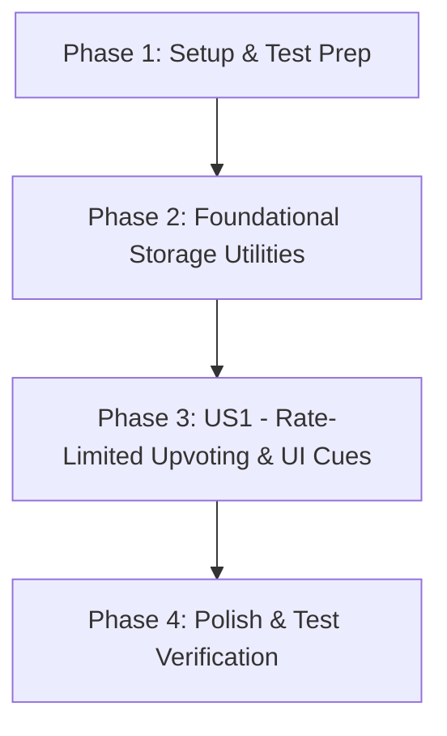

# Tasks: Myth Upvote Rate Limiting & Anti-Spam Safeguard

**Feature Identifier**: `2-limit-myth-upvotes`  
**Created Date**: 2026-07-29  
**Status**: Completed 🎉  

---

## Dependency Graph

---

## Parallel Execution Opportunities

- **Phase 2 & Phase 3**: `T004` (Unit tests) can be developed in parallel with `T002`/`T003` (Storage helpers).
- **Phase 4**: `T007` (Accessibility audit) can be executed concurrently with `T008` (Manual & unit test verification).

---

## Phase 1: Setup & Test Prep

- [X] T001 Verify project test runner setup and create test directory structure in `tests/storage.test.js`

---

## Phase 2: Foundational Storage Utilities

- [X] T002 [P] Implement `getUpvoteTimestamps` and `canUserUpvote` utility functions in `src/utils/storage.js`
- [X] T003 Update `recordUpvoteTimestamp` and `incrementHeardVote` in `src/utils/storage.js` to enforce 24-hour rolling rate limit

---

## Phase 3: User Story 1 - Rate-Limited Upvoting & UI Cues (Priority: P1)

**Story Goal**: Visitors can click *"I've heard this!"* once per myth card per 24-hour window. Upvoted cards render a disabled button displaying `"Voted ✓"` with a 24-hour cooldown tooltip.  
**Independent Test Criteria**: User clicks upvote on a myth card, button changes to `"Voted ✓"` (disabled) with tooltip; refreshing the page preserves disabled state; clicking a different card allows 1 upvote on that card independently.

- [X] T004 [P] [US1] Create automated unit tests for 24-hour rate-limiting and local storage persistence in `tests/storage.test.js`
- [X] T005 [US1] Update `renderMythCards` in `src/components/MythCards.js` to evaluate `canUserUpvote` and render disabled `"Voted ✓"` state with native tooltip
- [X] T006 [US1] Update `bindMythCardsEvents` in `src/components/MythCards.js` to handle rate-limited click events safely

---

## Phase 4: Polish & Quality Assurance

- [X] T007 [P] Perform accessibility audit (a11y) for disabled button state, title attribute tooltips, and ARIA attributes in `src/components/MythCards.js`
- [X] T008 Verify automated unit test suite execution with Vitest and manual verification across browser refreshes

---

## Implementation Strategy & MVP Scope

- **MVP Scope**: Complete Phase 1 through Phase 3 (Tasks T001 to T006). This delivers the complete end-to-end anti-spam upvote safeguard with local storage persistence and accessible UI cues.
