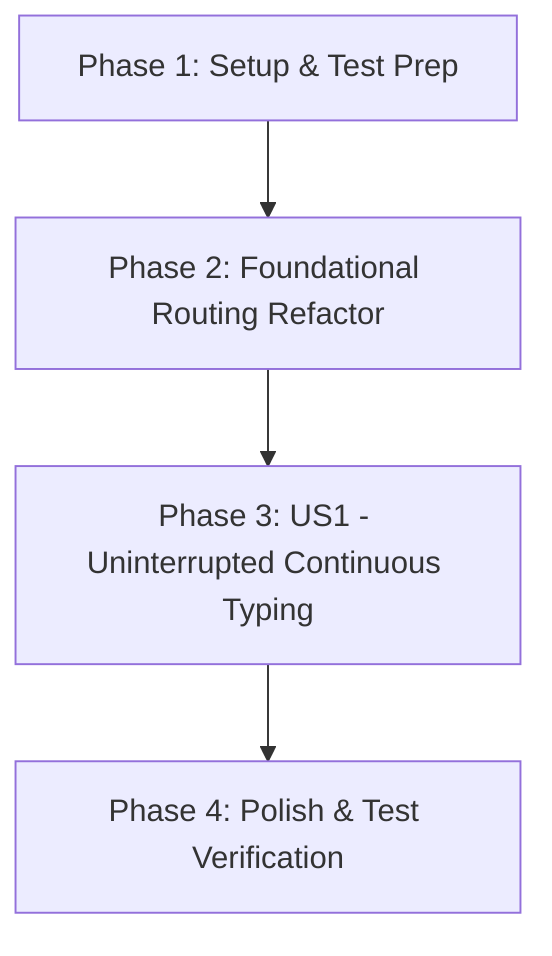

# Tasks: Search Bar Continuous Typing & Live Query Resolution

**Feature Identifier**: `3-fix-search-bar`  
**Created Date**: 2026-07-29  
**Status**: Completed 🎉  

---

## Dependency Graph

---

## Parallel Execution Opportunities

- **Phase 3**: `T003` (Unit/integration tests in `tests/search.test.js`) can be created in parallel with `T004` (Navbar search input value preservation in `src/components/Navbar.js`).

---

## Phase 1: Setup & Test Prep

- [X] T001 Verify project test runner setup and create unit test structure in `tests/search.test.js`

---

## Phase 2: Foundational Routing Refactor

- [X] T002 Refactor `handleSearchInput(query)` in `src/main.js` to target and update only the `<main>` content element, avoiding full-page navbar re-renders that destroy input DOM nodes

---

## Phase 3: User Story 1 - Uninterrupted Continuous Typing (Priority: P1)

**Story Goal**: Visitors can type full words and multi-word phrases into the global search bar without losing focus or resetting cursor placement after 1 character.  
**Independent Test Criteria**: Focusing `#global-search-input` and typing "atopic dermatitis" preserves focus, retains full text in the input box, and displays filtered search results under the header.

- [X] T003 [P] [US1] Create automated unit tests for search query state and view selection in `tests/search.test.js`
- [X] T004 [P] [US1] Ensure `renderNavbar` in `src/components/Navbar.js` preserves and reflects `searchQuery` without unmounting DOM input nodes
- [X] T005 [US1] Ensure clearing the search query in `src/main.js` smoothly restores active tab content in `<main>`

---

## Phase 4: Polish & Quality Assurance

- [X] T006 [P] Verify search accessibility (`aria-label`, keyboard focus, contrast) in `src/components/Navbar.js`
- [X] T007 Execute automated unit test suite with `npm test` and verify browser manual typing behavior

---

## Implementation Strategy & MVP Scope

- **MVP Scope**: Complete Phase 1 through Phase 3 (Tasks T001 to T005). This restores continuous multi-word typing in the global search bar without focus loss.
