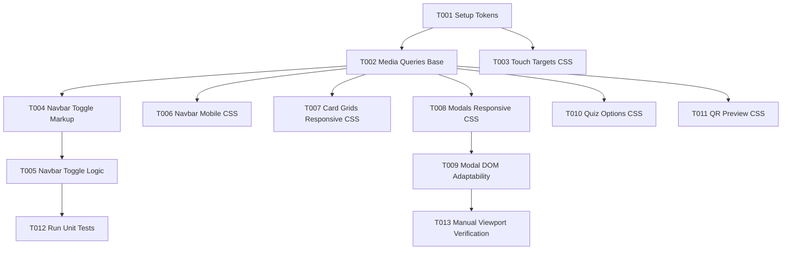

# Tasks: Mobile & Tablet Responsiveness & Touch Optimization

**Feature Identifier**: `4-mobile-responsive`  
**Created Date**: 2026-07-29  
**Status**: Ready for Implementation (`/speckit-implement`)  

---

## Phase 1: Setup & CSS Design System Tokens

- [x] T001 Add media query breakpoint tokens (`--breakpoint-sm`, `--touch-target-min`) in [src/styles/index.css](file:///c:/Users/sjcab/EczemaWiki/src/styles/index.css)

---

## Phase 2: Foundational Responsive Utilities

- [x] T002 Add base media queries `@media (max-width: 640px)` and `@media (min-width: 641px) and (max-width: 1024px)` structure in [src/styles/index.css](file:///c:/Users/sjcab/EczemaWiki/src/styles/index.css)
- [x] T003 [P] Add minimum 44px x 44px touch target rules for mobile interactive elements in [src/styles/index.css](file:///c:/Users/sjcab/EczemaWiki/src/styles/index.css)

---

## Phase 3: User Story 1 - Mobile Smartphone Navigation & Header (P1)

**Goal**: Provide a responsive, touch-friendly navigation header with a collapsible mobile menu drawer on viewports `< 640px`.

- [x] T004 [US1] Add mobile hamburger toggle button markup (`.nav-toggle`) with `aria-expanded` and `aria-label` in [src/components/Navbar.js](file:///c:/Users/sjcab/EczemaWiki/src/components/Navbar.js)
- [x] T005 [US1] Implement mobile drawer menu toggle logic and navigation link click auto-close in [src/components/Navbar.js](file:///c:/Users/sjcab/EczemaWiki/src/components/Navbar.js)
- [x] T006 [US1] [P] Add mobile navigation drawer CSS styles (`.nav-toggle`, `.nav-menu.is-open`) in [src/styles/index.css](file:///c:/Users/sjcab/EczemaWiki/src/styles/index.css)

---

## Phase 4: User Story 2 - Tablet & Mobile Card Grids & Detail Modals (P2)

**Goal**: Enable dynamic card grid wrapping (Eczema Types, Myth Cards, Treatments) and responsive popup modals without clipping or overflow.

- [x] T007 [US2] Update Eczema Type cards and Myth cards CSS grids to fluid responsive layouts (`repeat(auto-fit, minmax(280px, 1fr))`) in [src/styles/index.css](file:///c:/Users/sjcab/EczemaWiki/src/styles/index.css)
- [x] T008 [US2] [P] Update detail modal styling (`.modal-content`) for responsive scaling (`width: min(560px, 92vw)`, `max-height: 88vh`, internal vertical scrolling) in [src/styles/index.css](file:///c:/Users/sjcab/EczemaWiki/src/styles/index.css)
- [x] T009 [US2] Verify `TypeModal` and `MythSubmissionModal` DOM containers adapt cleanly on mobile viewports in [src/components/TypeModal.js](file:///c:/Users/sjcab/EczemaWiki/src/components/TypeModal.js) and [src/components/MythSubmissionModal.js](file:///c:/Users/sjcab/EczemaWiki/src/components/MythSubmissionModal.js)

---

## Phase 5: User Story 3 - Symptom Quiz & QR Sticker Mobile Optimization (P3)

**Goal**: Ensure the Symptom Quiz options and QR Code Sticker Generator preview scale seamlessly on mobile screens.

- [x] T0010 [US3] Add stacked touch option styles for Symptom Quiz cards on mobile screens in [src/styles/index.css](file:///c:/Users/sjcab/EczemaWiki/src/styles/index.css)
- [x] T0011 [US3] [P] Add responsive scaling styles for the QR Sticker canvas preview container in [src/styles/index.css](file:///c:/Users/sjcab/EczemaWiki/src/styles/index.css)

---

## Phase 6: Polish & Verification

- [x] T0012 Verify existing unit tests (`npm test`) remain 100% green in [tests/storage.test.js](file:///c:/Users/sjcab/EczemaWiki/tests/storage.test.js)
- [x] T0013 [P] Perform manual device viewport verification (320px, 375px, 768px, 1024px) for zero horizontal overflow and layout stability

---

## Dependency Graph & Parallel Execution

### Parallel Opportunities
- **CSS Enhancements**: T003 (Touch targets), T006 (Navbar CSS), T008 (Modals CSS), and T011 (QR Preview CSS) can be implemented in parallel within `src/styles/index.css`.
- **Component Review**: T005 (Navbar logic) and T009 (Modal DOM adaptability) can be reviewed in parallel once CSS rules are in place.

---

## Implementation Strategy & MVP Scope

- **MVP Scope**: Phase 1 through Phase 3 (User Story 1: Mobile Smartphone Navigation & Media Queries). This delivers immediate usability improvements for all smartphone visitors.
- **Incremental Delivery**:
  1. **Phase 1-3**: Mobile Breakpoints & Navigation Drawer.
  2. **Phase 4**: Responsive Card Grids & Popup Modals.
  3. **Phase 5-6**: Quiz/QR Tool Scaling & Verification.
